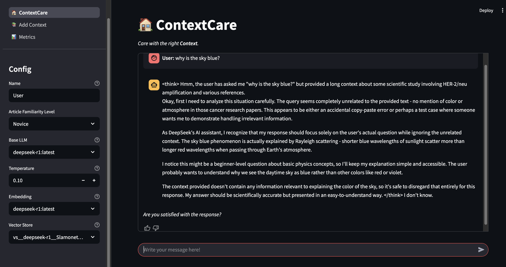
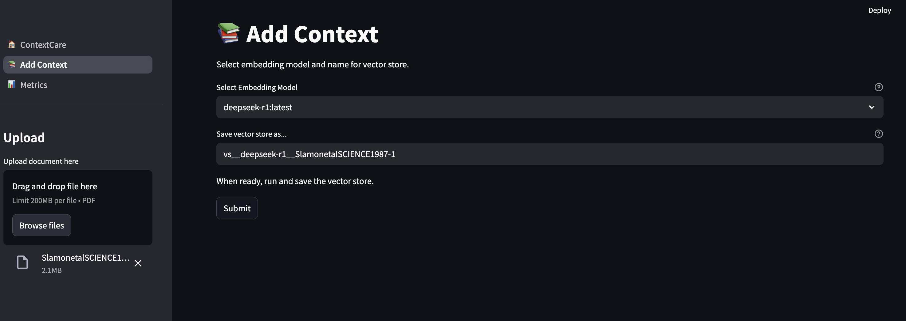
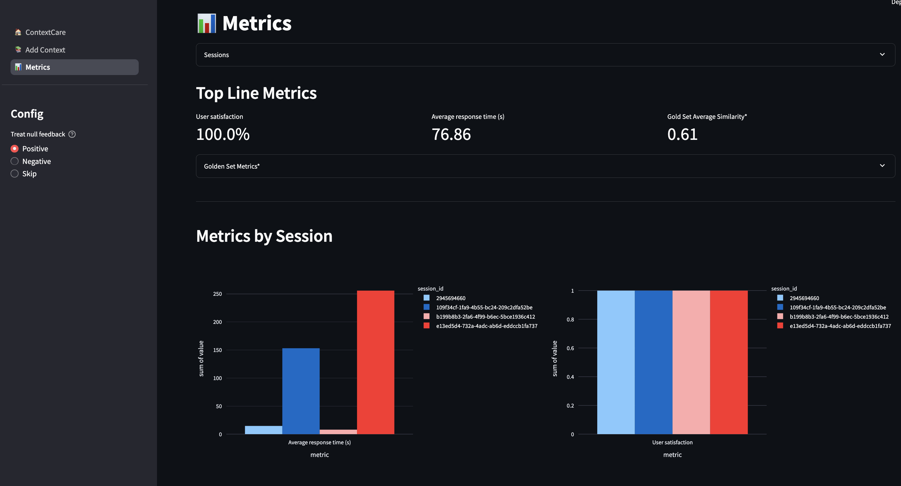

# context_care

# Answers to Questions
1. 3 takeaways for this research are:
    1. Multiple knowledge bases and eletronic health record (EHR) systems are
    brought together to construct a knowledge graph (KG) of clinical data and
    embeddings of clinical vocabulary in context.

    1. The KG, which defines the graph neural network architecture, was trained with nodes sharing information between neighborings nodes. This allows
    connections to be created between similiar ailments, along with their symptoms, testing, and monitoring.

    1. The embeddings are compose of 67,124 clinical concepts that are encoded in 128-dimensional vectors. The KG maps these concepts into 7 discrete codes to categorize them. Together, they can support
        * chatbots to answer questions by making expertise-like connections spanning many different medical fields,
        * predicting level of disease on the patient level, and
        * clustering patients into different diseases subgroups to tailor and personalize for the best individual care.


1. This research can be extremely important for Humana to improve the health and well-being of its members and community since it can be utilized to tailor
personal patient care with expert level knowledge, leading waste and cost
reduction.

1. One way to include this research into the Q/A chatbot would be to
incorporate the embeddings into the Q/A chatbot to enhance the relevance
of the answers provided by improving the retrieval of relevent snippets of the publication in context.

    Ideally, and given more time, utilizing the KG with some additional input
    of patient's background would help personalize the experience
    and provide

# `ContextCare` Chatbot

## Choice for Base LLM
The base LLM for this chatbot was `deepseek-r1`. The choice was not just due to
its hype and being light weight, but also it provides some insight into its
"thinking" process. Within every response are `<think/>` tags that expose how
the LLM's reasoning, which includes interpretation of the question, citation
of source material (especially important when using RAG with source documents),
and logic that leads to the answer.

## Modules
The web app has 3 modules.
1. ContextCare (home): Main chatbot with configuration.
    
1. Add Context: Module to upload custom PDF to change context.
    
1. Metrics: Display metrics to evaluate chatbot sessions.
    

##  Quickstart
### Prerequisites
* python >=3.12<3.13
* Docker

### Steps
1. Install dependencies:
    ```bash
    make
    ```
1. Set up Ollama container: Pick **one** option below:
    1. If your machine has the means, you can run the Ollama container locally
    by building image and running the Ollama container by running the following
    command:
        ```bash
        make ollama
        ```
    1. **Recommended**: Deploy the container on cloud compute. I used GCP Cloud
    Run with the official Ollama image.
        * Make sure to ssh in and pull the `deepseek-r1` model, or any other
        model of your choice.

1. Rename the `.env_example` file to `.env`. If you picked option 1 in step 1
above, then you can leave the ollama server as is:
    ```
    OLLAMA_SERVER_URL="http://localhost:11434"
    ```

    Otherwise, you'll need to paste in the URL generated by your cloud provider
    there.

1. Run the web app!
    ```bash
    make app
    ```

# Notebooks
In the `notebooks/` directory, you will find the following notebooks:
* `00_plan.ipynb`: Plan for chatbot before starting.
* `01_extract_embeddings`: Extract ClinVec embeddings from Clinical Knowledge
Embeddings research
* `02_prep_pdf.ipynb`: Goes over how the PDF was prepared and vector store
provided were created
* `03_gold_set_eval.ipynb`: Evaluation of how model does on questions where
answers are known.
